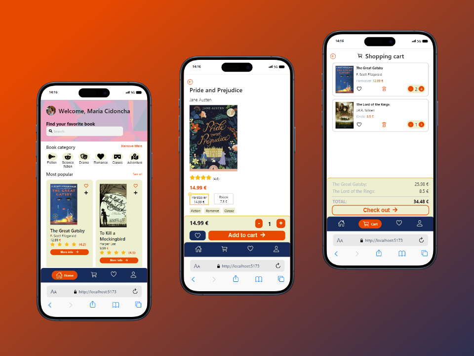

# Welcome to Bookpedia: A React-Powered E-Commerce Project <!-- omit in toc -->

## Table of contents <!-- omit in toc -->

- [💡 About the project](#-about-the-project)
- [⚙️ Technologies used](#️-technologies-used)
- [📓 Daily records](#-daily-records)
- [⚠️ Struggles](#️-struggles)

## 💡 About the project

Welcome to Bookpedia, an e-commerce platform developed as a part of a master's degree project. This project is a demonstration of advanced coding skills, with a primary focus on utilizing the React library to create an immersive and efficient user experience for book enthusiasts.

Bookpedia leverages React's capabilities to elevate user interaction. The project incorporates real-time updates, ensuring that users experience a dynamic interface that responds to their actions instantly. The integration of React Router enables seamless navigation, creating a single-page application that enhances the overall user journey.

## ⚙️ Technologies used

- `React`: A declarative and efficient JavaScript library for building user interfaces.
- `React Router`: A standard library for routing in React applications.
- `react-hot-toast`: A React library that provides a lightweight and customizable solution for displaying toast notifications in a web application.
- `react-icons`: A React library that offers a diverse collection of icons.
- `unavatar.io`: a versatile API service that simplifies the process of retrieving a user's avatar by providing a single endpoint to fetch profile pictures from various social platforms

## 📓 Daily records

##### Day 1: 06/02/24 <!-- omit in toc -->

- Figma - Login and Home

##### Day 2: 07/02/24 <!-- omit in toc -->

- Figma - Product details and Cart
- Click up

##### Day 3: 08/02/24 <!-- omit in toc -->

- Login layout
- Login style
- Create routes

##### Day 4: 09/02/24 <!-- omit in toc -->

- Create private routes
- Create .json files with user and products
- Create Auth User Context
- Add form validation on Login page

##### Day 5: 12/02/24 <!-- omit in toc -->

- Home page layout
- Home page style
- Print products cards on home page
- Add link on each product cart

##### Day 6: 13/02/24 <!-- omit in toc -->

- Product page layout
- Product page style
- Dynamic link

##### Day 7: 14/02/24 <!-- omit in toc -->

- Cart page layout
- Cart page style
- Add filter search
- Add filter category
- Add button to remove filters

##### Day 8: 15/02/24 <!-- omit in toc -->

- Add catalog page
- Show only 5 products on home page
- Add "add to cart" button on product page

##### Day 9: 16/02/24 <!-- omit in toc -->

- Update price on change cover option
- Add buttons to add/remove items on cart page
- Update total price on cart page

##### Day 10: 19/02/24 <!-- omit in toc -->

- Finish cart page features
- Add user to local storage

##### Day 11: 20/02/24 <!-- omit in toc -->

- Add log out feature
- Add message if cart is void
- Add message if filter result is void

##### Day 12: 21/02/24 <!-- omit in toc -->

- Checkout page layout
- Checkout page style

##### Day 13: 22/02/24 <!-- omit in toc -->

- Checkout - resume
- Checkout - shipping options

##### Day 14: 23/02/24 <!-- omit in toc -->

- Checkout - payment section
- Checkout - discounts
- Delete item from cart

#### Day 15: 26/02/2024 <!-- omit in toc -->

- Add recommended products section
- Add pop up when checkout is confirmed
- Wishlist page layout
- Wishlist page style
- Wishlist carts rendered
- Heart style depends if the product is added to the wishlist or not
- Add "add/remove" to wishlist feature

## ⚠️ Struggles

- Adding image on a second page ex.: product/id1
- Difficult to understand how to render a component in order to update information
